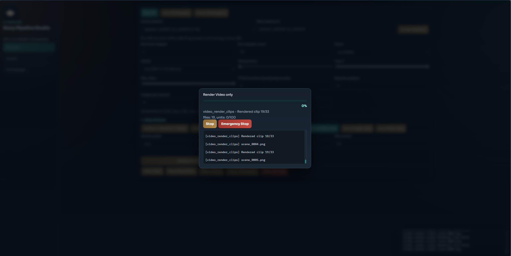

<p align="center">
  
</p>

<p align="center">
  
</p>

<h1 align="center">Ambrouse Spam Audio Video V2</h1>
<p align="center"><strong>FREE Local AI Story Studio + Browser Bridge</strong></p>

<p align="center">
  Build stories from chapter URLs -> rewrite -> clean -> chunk -> TTS -> video,<br />
  with a local browser automation bridge for Gemini/GPT workflows.
</p>

<p align="center">
  
  
  
  
  
</p>

<p align="center">
  <a href="#why-this-repo">Why</a> •
  <a href="#how-it-works">How It Works</a> •
  <a href="#quick-start">Quick Start</a> •
  <a href="#key-features">Features</a> •
  <a href="#api-at-a-glance">API</a> •
  <a href="#docs-index">Docs</a>
</p>

---

## Windows Portable App

Use this when you want the most stable "download, extract, run" build.

```powershell
powershell -ExecutionPolicy Bypass -File scripts/portable/build_portable_release.ps1 -Version v0.1.6
```

Output:

```text
dist/ambrouse-studio-v0.1.6-win64.zip
```

User flow:

1. Download `ambrouse-studio-v0.1.6-win64.zip` from GitHub Releases.
2. Extract it to a normal folder, for example `D:\AmbrouseStudio`.
3. Run `RUN.bat`.
4. Open `http://127.0.0.1:8080`.
5. In the Bridge tab, open/ping ports and login Gemini/GPT once.

The portable zip includes Python, Node, and the production Rust/D3D11/NVENC story renderer binary, so users do not need to install Python, Node, or Rust manually. NVIDIA driver and Chrome/Gemini/GPT login are still machine-specific and must exist on the target PC.

`v0.1.6` is the clean production pipeline release: the old segmented video clip path is removed from the main source, audio merge is streaming for long jobs, and CI validates both Python policy tests and the Windows Rust renderer build.

---

## Why This Repo?

Stop splitting workflows across separate tools and repos:

- chapter collection and rewrite are disconnected from TTS/video output.
- browser automation and content pipeline are managed in different environments.
- runtime setup is fragile when switching machines.
- free-first AI workflow is hard to keep stable without a local bridge.

This combined repo solves it:

- one workspace for text -> audio -> video production.
- one local FastAPI bridge for Gemini/GPT browser automation.
- project/session registry to track long-running content pipelines.
- local-first operation with practical bring-up scripts.

---

## How It Works

```text
chapters urls
  -> spam_audio_video/auto_convert_text
     (collect + rewrite + clean + chunk + export tts text)
  -> spam_audio_video/auto_text_to_voice
     (voice select + wav generation + manifest + combine)
  -> spam_audio_video/auto_generate_video
     (prompt/image/render/merge per session)

browser/tab automation (Gemini/GPT)
  -> toll-brouser-gpt-gemini/examples/apps/gemini-use/server.py
     (CDP session + chat/image endpoints)

video production
  -> spam_audio_video/renderers/story_gpu_renderer
     (single Rust/D3D11/NVENC full-timeline render + final audio mux)
```

---

## Repo Layout

```text
spam_audio_video/
  AI Story Audio/Video pipeline studio (convert + tts + video + web UI)

toll-brouser-gpt-gemini/
  Local browser bridge for Gemini/GPT automation via CDP and FastAPI

plans/
  Refactor and implementation plans
```

---

## Quick Start

### 1) Clone combined repo

```bash
git clone https://github.com/ambrouse/ambrouse-spam_audio_video_v2.git
cd "ambrouse-spam_audio_video_v2"
```

### 2) Bring up story pipeline studio

```bash
cd spam_audio_video
bash setup.sh
```

Default web UI: `http://localhost:8080` (auto fallback if busy).

For a release/new-machine validation without starting the web server:

```bash
bash setup.sh --install-only --yes --production-validate --tts-device cuda
```

This performs dependency checks, validates CUDA TTS imports, prewarms VoxCPM,
runs unit tests, generates one real VoxCPM WAV with `temperature=0.05` and
`postprocess=false`, then checks that the WAV is not clipped. Use
`--skip-production-validation` only when preparing a machine that cannot run
the local model yet.

GPU runtime defaults are GPU-first after clone:

- `setup.sh` defaults `SETUP_TTS_DEVICE=auto`; when `nvidia-smi` is available it installs CUDA PyTorch for the TTS runtime.
- the web audio runtime defaults to `SPAM_TTS_DEVICE=cuda`, so a CPU-only TTS environment fails loudly instead of silently running on CPU.
- video render resolves to a hardware H.264 encoder (`h264_nvenc`, `h264_qsv`, or `h264_amf`); CPU `libx264` is blocked in the production path.
- `.env` is optional. Copy `spam_audio_video/.env.example` only when you want explicit local overrides.

### 3) Bring up local browser bridge

```bash
cd ../toll-brouser-gpt-gemini
bash setup.sh
```

Bridge API docs: `http://127.0.0.1:8008/docs`

### 4) Optional health checks

```bash
curl http://127.0.0.1:8008/v1/ports/ping
curl http://127.0.0.1:8080/api/health
```

---

## Key Features

| Feature | What It Does | Why It Matters |
| --- | --- | --- |
| Unified Pipeline Studio | collect -> rewrite -> clean -> chunk -> TTS export -> video flow | End-to-end production in one place |
| Project + Session Registry | Tracks per-project and per-session artifacts/status | Easy rerun, debug, and lifecycle control |
| Voice Profile Runtime | Uses folder-based voice profiles and TTS manifests | Practical voice switching without code edits |
| GPU Runtime Guard | TTS requires CUDA on GPU machines and video blocks CPU encode fallback | Prevents accidental slow CPU production runs |
| Download + Clear APIs | Clear local artifacts and download generated files | Faster iteration and cleanup |
| Browser CDP Bridge | Opens/reconnects Gemini/GPT tabs via local CDP | Stable web automation with your own logged-in sessions |
| Fail-fast Port Policy | Exits with actionable errors on occupied/unreachable ports | Predictable runtime behavior |
| Free-first Workflow | Designed around local sessions and browser-driven AI operations | Lower recurring cost and no forced paid API |

---

## API At A Glance

### Story Studio (spam_audio_video)

- `GET /api/health`
- `POST /api/convert/run-full`
- `POST /api/pipeline/audio/run`
- `POST /api/pipeline/video/run`
- `GET /api/jobs/{job_id}`
- `GET /api/files/download/audio?filename=...`
- `GET /api/files/download/video?filename=...&project_id=...&session_id=...`

### Browser Bridge (toll-brouser-gpt-gemini)

- `POST /v1/web/open`
- `GET /v1/ports/ping`
- `POST /v1/ports/close`
- `POST /v1/chat/gemini`
- `POST /v1/chat/gpt`
- `POST /v1/image/gemini`
- `POST /v1/image/gpt`

---

## Docs Index

Primary docs from story pipeline:

- `docs/release_notes_v0.1.6.md`
- `docs/release_notes_v0.1.5.md`
- `docs/setup_release_validation_2026-05-17.md`
- `docs/portable_windows_release.md`
- `docs/native_full_timeline_2026-05-17.md`
- `spam_audio_video/docs/gpu_runtime_2026-05-14.md`
- `spam_audio_video/docs/architecture_audio_pipeline.md`
- `spam_audio_video/docs/architecture_auto_convert_text.md`
- `spam_audio_video/docs/project_management_ui.md`
- `spam_audio_video/docs/test_report_audio_pipeline.md`
- `spam_audio_video/docs/test_report_video_pipeline.md`

Bridge docs:

- `toll-brouser-gpt-gemini/README.md`
- `toll-brouser-gpt-gemini/docs/`

---

## Git Strategy For This Combined Repo

This repository is intentionally configured as one root Git repository containing both source trees.

- Nested `.git` directories in child folders are removed.
- No submodule links to original upstream repositories.
- Single remote origin points to:
  - `https://github.com/ambrouse/ambrouse-spam_audio_video_v2.git`

---

## License

- `spam_audio_video`: Proprietary (Internal Use)
- `toll-brouser-gpt-gemini`: MIT
