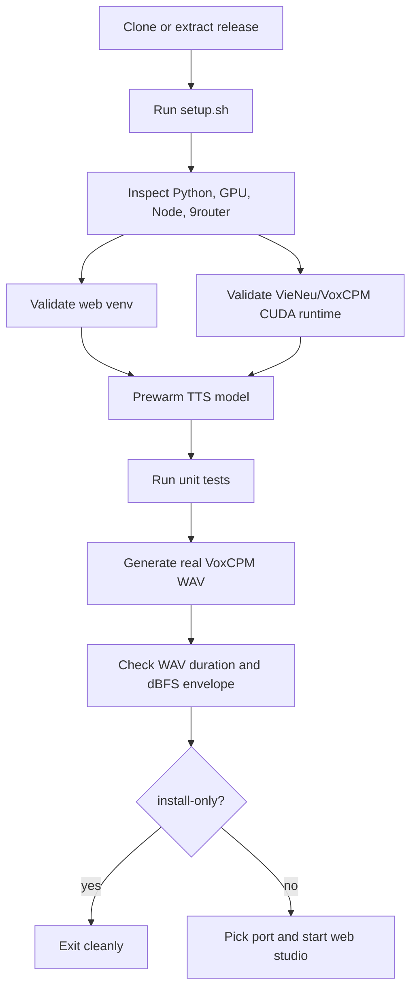

# Setup And Release Validation - 2026-05-17

## Purpose

This release hardens the new-machine path for the story audio/video studio.
The setup script now installs or validates the real local runtime, asks before
manual-risk actions, and can run a real VoxCPM production validation before a
machine is considered ready.

## Setup Contract

Recommended validation command:

```bash
cd spam_audio_video
bash setup.sh --install-only --yes --production-validate --tts-device cuda
```

What this verifies:

| Area | Check |
| --- | --- |
| Shell | `setup.sh` parses under Bash with LF line endings |
| Web runtime | FastAPI, Uvicorn, Playwright, `imageio_ffmpeg` import |
| Browser bridge helper | `9router` is present or setup asks to install it |
| TTS runtime | VoxCPM/VieNeu imports, CUDA torch availability when requested |
| Text policy | Unit tests confirm comma-free, period-only TTS chunks |
| Production audio | Real one-chunk VoxCPM synthesis with cache disabled |
| Quality gate | WAV exists, duration is non-trivial, peak/RMS are not clipped |

## Flow



## Latest Local Validation

Historical setup-validation reports were removed from source during the
`v0.1.6` cleanup so the repository does not carry generated benchmark output.
Run the command below on a target Windows machine to regenerate local reports
under the ignored `spam_audio_video/benchmarks/setup_validation/` tree:

```bash
cd spam_audio_video
bash setup.sh --install-only --yes --production-validate --tts-device cuda
```

Last observed local result before report cleanup:

| Metric | Value |
| --- | --- |
| Command | `bash setup.sh --install-only --yes --production-validate --tts-device cuda` |
| Setup result | Pass |
| Real TTS validation | Pass |
| Cache | Disabled |
| Audio duration | 3.924s |
| TTS elapsed | 18.413s |
| WAV envelope | peak `-6.06 dBFS`, RMS `-18.78 dBFS` |
| Quality config | `temperature=0.05`, `top_k=80`, `postprocess=false` |

Audio/media artifacts and generated validation reports stay ignored by
`.gitignore`; keep only summarized release evidence in docs.

## Portable Release Validation

Built release asset:

```text
dist/ambrouse-studio-v0.1.3-win64.zip
```

Release extraction test:

| Check | Result |
| --- | --- |
| Extract `v0.1.3` zip to `D:\ambrouse-release-test-v013` | Pass |
| `spam_audio_video/setup.sh --install-only --yes --production-validate --tts-device cuda` from extracted release | Pass |
| Extracted release real TTS validation | Pass: 3.548s WAV, peak `-6.13 dBFS`, RMS `-18.43 dBFS` |
| `toll-brouser-gpt-gemini/setup.sh --setup-only --yes` from extracted release | Pass |
| Gemini/GPT bridge batch tests from extracted release | Pass, 9 tests |
| `CHECK_GPU.bat` from extracted release | Pass: CUDA torch available, encoder `h264_nvenc` |

## Manual Setup Notes

When automatic install is not possible:

- Install Python 3.12 on Windows for the TTS runtime.
- Install Node.js LTS so `npm` can install `9router`.
- Install or update NVIDIA drivers before requesting `--tts-device cuda`.
- Install Chrome/Chromium and log in to Gemini/GPT once for browser-driven
  rewrite/image workflows.
- Re-run setup with `--production-validate` after fixing any runtime issue.

## Release Notes

Release candidates should pass:

```bash
bash -n spam_audio_video/setup.sh toll-brouser-gpt-gemini/setup.sh toll-brouser-gpt-gemini/bin/setup.sh
python -m unittest discover -s spam_audio_video/tests
cd spam_audio_video
bash setup.sh --install-only --yes --production-validate --tts-device cuda
```

GitHub Actions now covers syntax/unit policy checks. Full model validation
remains local because hosted CI does not provide the required GPU/model runtime.
