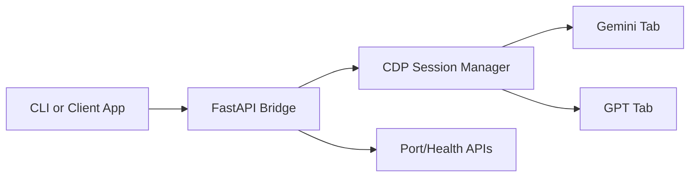

# toll-brouser-gpt-gemini

Local-first Browser Use fork for Gemini and GPT web automation through one FastAPI bridge.


## What This Repo Solves

This fork is focused on production-like local operation instead of demo-only usage:

- one command bring-up for API bridge and dependencies
- direct CDP automation for Gemini and GPT browser tabs
- clear fail-fast behavior for port conflicts
- free-first workflow using your own browser sessions

Main code locations:

- Bridge server: [examples/apps/gemini-use/server.py](examples/apps/gemini-use/server.py)
- Bring-up script: [setup.sh](setup.sh)
- Browser Use source: [browser_use](browser_use)

## Architecture



## Quick Start

### 1) Clone

```bash
git clone https://github.com/baolnq-ai/toll-brouser-gpt-gemini.git
cd toll-brouser-gpt-gemini
```

### 2) Configure runtime (optional)

```bash
cp .env.example .env
```

### 3) Setup and run

```bash
./setup.sh
```

The setup script will:

- detect Python, Node, and uv
- create or reuse .venv
- install project dependencies
- load .env.example defaults and then .env overrides
- validate CDP target and start FastAPI bridge

OpenAPI docs:

- http://127.0.0.1:8008/docs

## Runtime Configuration

Defaults are defined in [.env.example](.env.example).

### Core Variables

| Variable | Default | Purpose |
| --- | --- | --- |
| GEMINI_CDP_URL | http://127.0.0.1:9222 | Chrome CDP endpoint used by bridge |
| GEMINI_API_HOST | 0.0.0.0 | FastAPI bind host |
| GEMINI_API_PORT | 8008 | FastAPI bind port |
| GEMINI_API_LOG_LEVEL | info | Uvicorn log level |

### Optional Controls

| Variable | Default | Purpose |
| --- | --- | --- |
| AUTO_LAUNCH_CHROME | 0 | Allow setup script to launch Chrome debug session |
| STRICT_CDP_STARTUP | 0 | Stop setup immediately if CDP is unreachable |
| CHROME_BIN | empty | Explicit Chrome executable path |
| CHAT_BRIDGE_AUTO_LAUNCH_CHROME | 1 | Bridge fallback launch for /v1/web/open |
| CHAT_BRIDGE_CHROME_BIN | empty | Chrome path override for bridge fallback |
| CHAT_BRIDGE_CHROME_PROFILE_DIR | empty | Profile root for bridge-launched sessions |

### Port Policy

The project intentionally uses fail-fast semantics:

- no automatic port shifting
- if GEMINI_API_PORT is busy, setup exits with an actionable error
- if CDP port from GEMINI_CDP_URL is busy but unreachable, setup exits with an actionable error

## API Surface

All routes are implemented in [examples/apps/gemini-use/server.py](examples/apps/gemini-use/server.py).

| Group | Method | Route | Description |
| --- | --- | --- | --- |
| Session | POST | /v1/web/open | Open or reconnect provider tab on a CDP port |
| Session | GET | /v1/ports/ping | Probe all managed ports |
| Session | POST | /v1/ports/ping | Probe specific port(s) |
| Session | POST | /v1/ports/close | Close managed session on port |
| Chat | POST | /v1/chat/gemini | Send prompt to Gemini tab |
| Chat | POST | /v1/chat/gpt | Send prompt to GPT tab |
| Image | POST | /v1/image/gemini | Trigger image generation via Gemini flow |
| Image | POST | /v1/image/gpt | Trigger image generation via GPT flow |

## Example Requests

Open Gemini tab on CDP port 9223:

```bash
curl -X POST "http://127.0.0.1:8008/v1/web/open" \
  -H "Content-Type: application/json" \
  -d '{
    "provider": "gemini",
    "port": 9223,
    "url": "https://gemini.google.com",
    "new_tab": true,
    "force_reconnect": false
  }'
```

Send prompt to Gemini:

```bash
curl -X POST "http://127.0.0.1:8008/v1/chat/gemini" \
  -H "Content-Type: application/json" \
  -d '{
    "prompt": "Hello from local bridge",
    "port": 9223
  }'
```

## Troubleshooting

| Symptom | Cause | Fix |
| --- | --- | --- |
| CDP_CONNECT_FAILED | CDP endpoint unreachable | Verify GEMINI_CDP_URL and Chrome remote debugging |
| setup exits on busy port | Port already in use | Free port or update GEMINI_API_PORT / GEMINI_CDP_URL in .env |
| Chrome not found on Windows | Auto-discovery failed | Set CHROME_BIN and CHAT_BRIDGE_CHROME_BIN explicitly |

Quick health check:

```bash
curl "http://127.0.0.1:8008/v1/ports/ping"
```

Setup log files:

- .setup.log at repo root
- .bin-setup.log for [bin/setup.sh](bin/setup.sh)

## Development

Create environment and sync dependencies:

```bash
uv venv --python 3.11
uv sync --dev --all-extras
```

Run quality checks:

```bash
uv run pyright
./bin/lint.sh
```

Run bridge server directly:

```bash
python examples/apps/gemini-use/server.py
```

## License

MIT. See [LICENSE](LICENSE).
